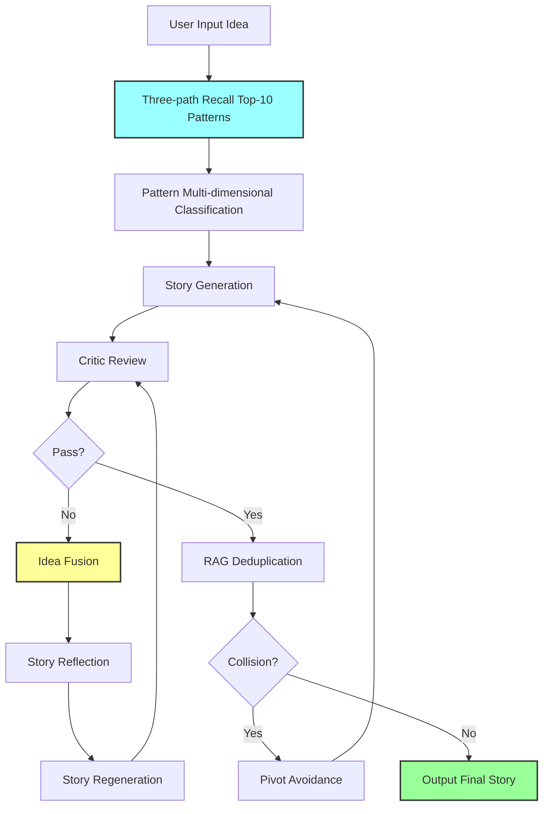

# Idea2Paper - Knowledge Graph-Based Academic Paper Automatic Generation System

**Project Overview**: Automatically transform user's research Idea into paper Story that meets top conference (ICLR) standards

**Core Technologies**:
- Knowledge Graph: 16,791 nodes, 444,872 edges
- Vector Retrieval: Two-stage recall (Jaccard+Embedding), 13x speedup
- Large Language Models: Qwen3-14B, Qwen2.5-7B-Instruct
- Data Source: ICLR 2025 paper dataset (8,285 papers)

---

## 🚀 Quick Start

### 1. Environment Setup

```bash
# Enter project directory
cd /Users/gaoge/code/mycode/Idea2Paper/Paper-KG-Pipeline

# Install dependencies
pip install -r requirements.txt

# Set API key
export SILICONFLOW_API_KEY="your_api_key_here"
```

### 2. Build Knowledge Graph (Only run once)

```bash
# Build nodes (approx. 15 minutes)
python scripts/build_entity_v3.py

# Build edges (approx. 3 minutes)
python scripts/build_edges.py
```

**Output**:
```
output/
├── nodes_idea.json           # 8,284 Idea nodes
├── nodes_pattern.json        # 124 Pattern nodes
├── nodes_domain.json         # 98 Domain nodes
├── nodes_paper.json          # 8,285 Paper nodes
├── edges.json                # Edge data
└── knowledge_graph_v2.gpickle # NetworkX graph
```

### 3. Generate Paper Story

```bash
# Use custom Idea
python scripts/idea2story_pipeline.py "Your research Idea description"

# Example
python scripts/idea2story_pipeline.py "Using reinforcement learning to optimize large model inference efficiency"
```

**Output**:
```
output/
├── final_story.json          # Final generated paper Story
├── pipeline_result.json      # Complete process results
└── log.json                  # Detailed logs
```

### 4. View Results

```bash
# View final Story
cat output/final_story.json

# View complete process
cat output/pipeline_result.json | jq '.'
```

---

## 📚 Core Documentation

### Essential Documents (Read in order)

| No. | Document | Content | Target Audience |
|-----|----------|---------|----------------|
| **0** | [Project Overview](docs/00_PROJECT_OVERVIEW.md) | Overall architecture, core modules, parameter configuration, execution flow | Everyone |
| **1** | [Knowledge Graph Construction](docs/01_KG_CONSTRUCTION.md) | Data sources, nodes, edge definitions, LLM enhancement, execution methods | Developers |
| **2** | [Recall System](docs/02_RECALL_SYSTEM.md) | Three-path recall strategy, similarity calculation, performance optimization | Developers |
| **3** | [Idea2Story Pipeline](docs/03_IDEA2STORY_PIPELINE.md) | Pattern selection, Idea Fusion, Story Reflection, Critic review | Developers |

### Documentation Features

✅ **Complete Coverage**: From data construction to generation full process<br>
✅ **Execution Guide**: Every document includes detailed execution methods and parameter configuration<br>
✅ **Flow Diagrams**: Clear architecture and process visualization using Mermaid charts<br>
✅ **Troubleshooting**: Includes common issues and solutions<br>

---

## 🎯 Core Features

### 1. Knowledge Graph (16,791 nodes)

**Node Types**:
- **Idea** (8,284): Core innovation points of papers
- **Pattern** (124): Writing patterns/method templates (124 LLM-enhanced)
- **Domain** (98): Research domains
- **Paper** (8,285): Specific papers

**Edge Types**:
- Basic connection edges: Paper→Idea, Paper→Pattern, Paper→Domain
- Recall assistance edges: Idea→Domain, Pattern→Domain (effectiveness scoring)

### 2. Three-Path Recall System (13x speedup)

| Path | Matching Target | Captured Dimension | Weight |
|------|----------------|-------------------|--------|
| **Path 1** | Idea Description | Core concept similarity | 0.4 |
| **Path 2** | Domain & Sub-domains | Domain generalization ability | 0.2 |
| **Path 3** | Paper Title | Research topic similarity | 0.4 |

**Performance**: Full Embedding ~7 minutes → Two-stage recall ~27 seconds (13x speedup)

### 3. Idea2Story Pipeline

**Core Mechanisms**:
- ✅ **Pattern Multi-dimensional Classification**: Stability/Novelty/Cross-Domain
- ✅ **Idea Fusion**: Organic fusion at conceptual level, not technical stacking
- ✅ **Story Reflection**: Evaluate fusion quality, ensure conceptual unity
- ✅ **Critic Multi-role Review**: Methodology/Novelty/Storyteller
- ✅ **Intelligent Refinement**: Novelty mode + score degradation rollback + fallback strategy
- ✅ **RAG Deduplication**: Avoid collision with existing work

---

## 🔧 System Architecture



---

## 📊 Key Metrics

### Data Scale
```
Knowledge Graph:
  - Nodes: 16,791 (Idea 8,284 + Pattern 124 + Domain 98 + Paper 8,285)
  - Edges: 444,872
  - Idea Coverage: 100% (8,284/8,285)
  - Pattern LLM Enhancement: 124/124 (100%)
```

### Performance Metrics
```
Recall Speed:
  - Full Embedding: ~7 minutes
  - Two-stage Recall: ~27 seconds (13x speedup)

Pipeline Execution Time:
  - Fastest: 3 minutes (first pass)
  - Typical: 5-7 minutes (2-3 refinement rounds)
  - Slowest: 10 minutes (novelty mode)
```

### Quality Metrics
```
Critic Review:
  - Pass Standard: Average score >= 7.0/10
  - Dimensions: Methodology, Novelty, Storyteller
  - Novelty Mode Improvement: 0.5-1.5 points

Fusion Quality:
  - Threshold: >= 0.65
  - Typical Value: 0.68-0.75
```

---

## 💡 Core Innovations

### Knowledge Graph Level
✅ **LLM-enhanced Patterns**: Generate inductive summaries for each Pattern cluster
✅ **Dual-layer Description**: Specific examples + global summary, both learnable and understandable
✅ **Quality-oriented Edge Weights**: Calculated based on paper quality and Pattern effectiveness

### Recall Level
✅ **Three-path Complementary Recall**: Capture relevance from idea, domain, and paper dimensions
✅ **Two-stage Optimization**: Jaccard coarse ranking + Embedding fine ranking, 13x speedup
✅ **Real-time Calculation Path 3**: Avoid pre-building redundant edges, ensure complementarity

### Generation Level
✅ **Idea Fusion**: Organic fusion at conceptual level
✅ **Story Reflection**: Reflect on fusion quality
✅ **Novelty Priority Mode**: Automatically upgrade when stagnating
✅ **Intelligent Rollback**: Avoid ineffective refinements
✅ **Fallback Strategy**: Ensure output quality

---

## 🛠️ Parameter Configuration

### Recall System Configuration

```python
# scripts/recall_system.py

class RecallConfig:
    # Path weights
    PATH1_WEIGHT = 0.4  # Similar Idea (important)
    PATH2_WEIGHT = 0.2  # Domain-related (auxiliary)
    PATH3_WEIGHT = 0.4  # Similar Paper (important)

    # Recall quantity
    FINAL_TOP_K = 10

    # Two-stage recall
    TWO_STAGE_RECALL = True
    COARSE_RECALL_SIZE = 100
```

### Pipeline Configuration

```python
# scripts/pipeline/config.py

class PipelineConfig:
    # Critic threshold
    PASS_SCORE = 7.0
    MAX_REFINE_ITERATIONS = 3

    # Novelty mode
    NOVELTY_MODE_MAX_PATTERNS = 10
    NOVELTY_SCORE_THRESHOLD = 6.0

    # Reflection
    FUSION_QUALITY_THRESHOLD = 0.65

    # Rollback
    SCORE_DEGRADATION_THRESHOLD = 0.1

    # RAG deduplication
    COLLISION_THRESHOLD = 0.75
```

---

## 🐛 Troubleshooting

### API Key Issues
```bash
# Check environment variable
echo $SILICONFLOW_API_KEY

# Set environment variable
export SILICONFLOW_API_KEY="your_key_here"
```

### Missing Data Files
```bash
# Rebuild knowledge graph
python scripts/build_entity_v3.py
python scripts/build_edges.py
```

### Empty Recall Results
```bash
# Check graph files
ls -lh output/nodes_*.json
ls -lh output/knowledge_graph_v2.gpickle
```

### More Issues
Refer to the "Troubleshooting" section in each core document.

---

## 📈 Performance Optimization Recommendations

### Improve Novelty
```python
# Increase novelty mode attempts
PipelineConfig.NOVELTY_MODE_MAX_PATTERNS = 15  # Default 10

# Increase Path 1 weight
RecallConfig.PATH1_WEIGHT = 0.5  # Default 0.4
```

### Improve Stability
```python
# Lower fusion quality threshold
PipelineConfig.FUSION_QUALITY_THRESHOLD = 0.60  # Default 0.65

# Increase Path 3 weight
RecallConfig.PATH3_WEIGHT = 0.5  # Default 0.4
```

### Accelerate Recall
```python
# Reduce recall quantity
RecallConfig.PATH1_TOP_K_IDEAS = 5   # Default 10
RecallConfig.PATH3_TOP_K_PAPERS = 10 # Default 20
```

---

## 🔍 Monitor Key Events

```bash
# Novelty mode activation
grep "Activated【Novelty Mode】" output/log.json

# Fusion quality scores
grep "Fusion quality score" output/log.json

# Rollback events
grep "【ROLLBACK TRIGGERED】" output/log.json

# Final pass
grep "🎉 Critic Review Passed" output/log.json
```

---

## 📦 Code Structure

```
Paper-KG-Pipeline/
├── data/ICLR_25/               # Data sources
├── output/                     # Output files
├── scripts/
│   ├── idea2story_pipeline.py  # Pipeline main entry (path unchanged)
│   ├── simple_recall_demo.py   # Compatibility wrapper (preferred: demos/)
│   ├── recall_system.py        # Recall system (shim)
│   ├── tools/                  # Build/ETL tools
│   │   ├── build_entity_v3.py  # Build nodes
│   │   ├── build_edges.py      # Build edges
│   │   └── ...
│   ├── demos/                  # Demo/experiment scripts
│   │   ├── simple_recall_demo.py
│   │   ├── run_pipeline.py
│   │   └── demo_pipeline.py
│   ├── legacy/                 # Archived legacy scripts
│   │   └── generate_patterns_old.py
│   └── pipeline/               # Pipeline modules (shim)
│       ├── config.py
│       ├── manager.py
│       ├── pattern_selector.py
│       ├── planner.py          # Idea Fusion
│       ├── story_generator.py
│       ├── story_reflector.py  # Story Reflection
│       ├── critic.py
│       ├── refinement.py
│       └── verifier.py
└── docs/                       # Core documentation (4 documents)
    ├── 00_PROJECT_OVERVIEW.md
    ├── 01_KG_CONSTRUCTION.md
    ├── 02_RECALL_SYSTEM.md
    └── 03_IDEA2STORY_PIPELINE.md
```

---

## 📝 Changelog

### V3.1 (2026-01-25)
- ✅ Integrated documentation system, retained 4 core documents
- ✅ All documents include execution methods, parameter configuration, and flow diagrams
- ✅ Historical documents archived to `docs/archive/`

### V3.0 (2026-01-22)
- ✅ Switched to ICLR 2025 data source
- ✅ Achieved 100% Idea coverage
- ✅ LLM-enhanced Pattern nodes
- ✅ Two-stage recall optimization (13x speedup)

### V2.0
- ✅ Idea Fusion mechanism
- ✅ Story Reflection mechanism
- ✅ Novelty priority mode
- ✅ Intelligent rollback mechanism

---

## 🎓 Acknowledgments

- Data Source: ICLR 2025 paper dataset
- API Service: SiliconFlow
- Authors: Idea2Paper Team

---

**Version**: V3.1
**Last Updated**: 2026-01-25
**Contact**: Refer to core documentation for technical support
