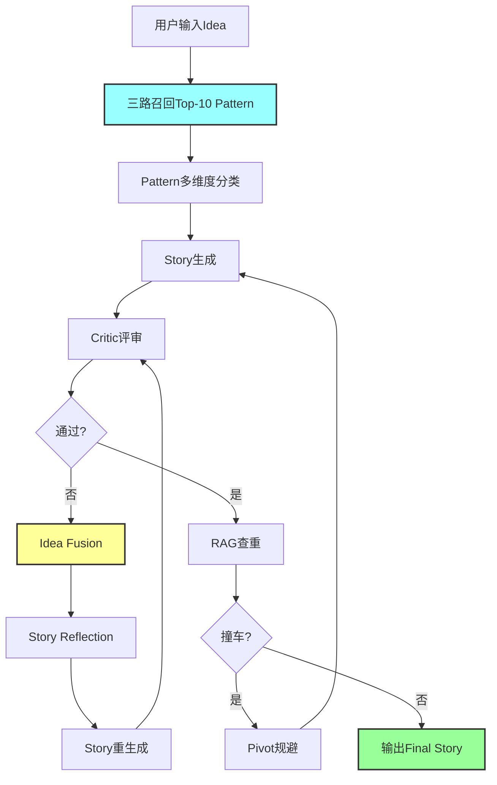

# Idea2Paper - 基于知识图谱的学术论文自动生成系统

**项目概述**: 将用户的研究Idea自动转化为符合顶会(ICLR)标准的论文Story

**核心技术**:
- 知识图谱: 16,791节点, 444,872条边
- 向量检索: 两阶段召回(Jaccard+Embedding), 13倍提速
- 大语言模型: Qwen3-14B, Qwen2.5-7B-Instruct
- 数据源: ICLR 2025论文数据集(8,285篇)

---

## 🚀 快速开始

### 1. 环境准备

```bash
# 进入项目目录
cd /Users/gaoge/code/mycode/Idea2Paper/Paper-KG-Pipeline

# 安装依赖
pip install -r requirements.txt

# 设置API密钥
export SILICONFLOW_API_KEY="your_api_key_here"
```

### 2. 构建知识图谱 (只需运行一次)

```bash
# 构建节点 (约15分钟)
python scripts/build_entity_v3.py

# 构建边 (约3分钟)
python scripts/build_edges.py
```

**输出**:
```
output/
├── nodes_idea.json           # 8,284个Idea节点
├── nodes_pattern.json        # 124个Pattern节点
├── nodes_domain.json         # 98个Domain节点
├── nodes_paper.json          # 8,285个Paper节点
├── edges.json                # 边数据
└── knowledge_graph_v2.gpickle # NetworkX图谱
```

### 3. 生成论文Story

```bash
# 使用自定义Idea
python scripts/idea2story_pipeline.py "你的研究Idea描述"

# 示例
python scripts/idea2story_pipeline.py "使用强化学习优化大模型推理效率"
```

**输出**:
```
output/
├── final_story.json          # 最终生成的论文Story
├── pipeline_result.json      # 完整流程结果
└── log.json                  # 详细日志
```

### 4. 查看结果

```bash
# 查看最终Story
cat output/final_story.json

# 查看完整流程
cat output/pipeline_result.json | jq '.'
```

---

## 📚 核心文档

### 必读文档 (按顺序阅读)

| 序号 | 文档 | 内容 | 适用对象 |
|------|------|------|---------|
| **0** | [项目总结](docs/00_PROJECT_OVERVIEW_zh.md) | 整体架构、核心模块、参数配置、运行流程 | 所有人 |
| **1** | [知识图谱构建](docs/01_KG_CONSTRUCTION_zh.md) | 数据源、节点、边定义、LLM增强、运行方式 | 开发者 |
| **2** | [召回系统](docs/02_RECALL_SYSTEM_zh.md) | 三路召回策略、相似度计算、性能优化 | 开发者 |
| **3** | [Idea2Story Pipeline](docs/03_IDEA2STORY_PIPELINE_zh.md) | Pattern选择、Idea Fusion、Story Reflection、Critic评审 | 开发者 |

### 文档特点

✅ **完整覆盖**: 从数据构建到生成全流程<br>
✅ **运行指南**: 每个文档都包含详细的运行方式和参数配置<br>
✅ **流程图**: 使用Mermaid图表清晰展示架构和流程<br>
✅ **故障排查**: 包含常见问题和解决方案<br>

---

## 🎯 核心功能

### 1. 知识图谱 (16,791节点)

**节点类型**:
- **Idea** (8,284): 论文的核心创新点
- **Pattern** (124): 写作套路/方法模板 (124个已LLM增强)
- **Domain** (98): 研究领域
- **Paper** (8,285): 具体论文

**边类型**:
- 基础连接边: Paper→Idea, Paper→Pattern, Paper→Domain
- 召回辅助边: Idea→Domain, Pattern→Domain (效果评分)

### 2. 三路召回系统 (13倍提速)

| 路径 | 匹配对象 | 捕捉维度 | 权重 |
|------|---------|---------|------|
| **路径1** | Idea Description | 核心思想相似性 | 0.4 |
| **路径2** | Domain & Sub-domains | 领域泛化能力 | 0.2 |
| **路径3** | Paper Title | 研究主题相似性 | 0.4 |

**性能**: 全量Embedding ~7分钟 → 两阶段召回 ~27秒 (提速13倍)

### 3. Idea2Story Pipeline

**核心机制**:
- ✅ **Pattern多维度分类**: Stability/Novelty/Cross-Domain
- ✅ **Idea Fusion**: 概念层面的有机融合,而非技术堆砌
- ✅ **Story Reflection**: 评估融合质量,确保概念统一
- ✅ **Critic多角色评审**: Methodology/Novelty/Storyteller
- ✅ **智能修正**: 新颖性模式+分数退化回滚+兜底策略
- ✅ **RAG查重**: 避免与现有工作撞车

---

## 🔧 系统架构



---

## 📊 关键指标

### 数据规模
```
知识图谱:
  - 节点: 16,791 个 (Idea 8,284 + Pattern 124 + Domain 98 + Paper 8,285)
  - 边:   444,872 条
  - Idea覆盖率: 100% (8,284/8,285)
  - Pattern LLM增强: 124/124 (100%)
```

### 性能指标
```
召回速度:
  - 全量Embedding: ~7分钟
  - 两阶段召回:   ~27秒 (提速13倍)

Pipeline执行时间:
  - 最快: 3分钟 (首次通过)
  - 典型: 5-7分钟 (2-3轮修正)
  - 最慢: 10分钟 (新颖性模式)
```

### 质量指标
```
Critic评审:
  - 通过标准: 平均分 >= 7.0/10
  - 维度: Methodology, Novelty, Storyteller
  - 新颖性模式提升: 0.5-1.5分

Fusion质量:
  - 阈值: >= 0.65
  - 典型值: 0.68-0.75
```

---

## 💡 核心创新点

### 知识图谱层面
✅ **LLM增强Pattern**: 为每个Pattern cluster生成归纳性总结
✅ **双层描述**: 具体示例+全局总结,既可学习又可理解
✅ **质量导向边权重**: 基于论文质量和Pattern效果计算

### 召回层面
✅ **三路互补召回**: 从思想、领域、论文三维度捕捉相关性
✅ **两阶段优化**: Jaccard粗排+Embedding精排,提速13倍
✅ **实时计算路径3**: 避免预构建冗余边,确保互补性

### 生成层面
✅ **Idea Fusion**: 概念层面的有机融合
✅ **Story Reflection**: 反思融合质量
✅ **新颖性优先模式**: 停滞时自动升级
✅ **智能回滚**: 避免无效修正
✅ **兜底策略**: 保证输出质量

---

## 🛠️ 参数配置

### 召回系统配置

```python
# scripts/recall_system.py

class RecallConfig:
    # 路径权重
    PATH1_WEIGHT = 0.4  # 相似Idea (重要)
    PATH2_WEIGHT = 0.2  # 领域相关 (辅助)
    PATH3_WEIGHT = 0.4  # 相似Paper (重要)

    # 召回数量
    FINAL_TOP_K = 10

    # 两阶段召回
    TWO_STAGE_RECALL = True
    COARSE_RECALL_SIZE = 100
```

### Pipeline配置

```python
# scripts/pipeline/config.py

class PipelineConfig:
    # Critic阈值
    PASS_SCORE = 7.0
    MAX_REFINE_ITERATIONS = 3

    # 新颖性模式
    NOVELTY_MODE_MAX_PATTERNS = 10
    NOVELTY_SCORE_THRESHOLD = 6.0

    # Reflection
    FUSION_QUALITY_THRESHOLD = 0.65

    # 回滚
    SCORE_DEGRADATION_THRESHOLD = 0.1

    # RAG查重
    COLLISION_THRESHOLD = 0.75
```

---

## 🐛 故障排查

### API密钥问题
```bash
# 检查环境变量
echo $SILICONFLOW_API_KEY

# 设置环境变量
export SILICONFLOW_API_KEY="your_key_here"
```

### 数据文件缺失
```bash
# 重新构建知识图谱
python scripts/build_entity_v3.py
python scripts/build_edges.py
```

### 召回结果为空
```bash
# 检查图谱文件
ls -lh output/nodes_*.json
ls -lh output/knowledge_graph_v2.gpickle
```

### 更多问题
参考各核心文档的"故障排查"章节。

---

## 📈 性能优化建议

### 提升新颖性
```python
# 增加新颖性模式尝试次数
PipelineConfig.NOVELTY_MODE_MAX_PATTERNS = 15  # 默认10

# 提高路径1权重
RecallConfig.PATH1_WEIGHT = 0.5  # 默认0.4
```

### 提升稳定性
```python
# 降低融合质量阈值
PipelineConfig.FUSION_QUALITY_THRESHOLD = 0.60  # 默认0.65

# 增加路径3权重
RecallConfig.PATH3_WEIGHT = 0.5  # 默认0.4
```

### 加速召回
```python
# 减少召回数量
RecallConfig.PATH1_TOP_K_IDEAS = 5   # 默认10
RecallConfig.PATH3_TOP_K_PAPERS = 10 # 默认20
```

---

## 🔍 监控关键事件

```bash
# 新颖性模式激活
grep "激活【新颖性模式】" output/log.json

# 融合质量评分
grep "融合质量评分" output/log.json

# 回滚事件
grep "【ROLLBACK TRIGGERED】" output/log.json

# 最终通过
grep "🎉 Critic 评审通过" output/log.json
```

---

## 📦 代码结构

```
Paper-KG-Pipeline/
├── data/ICLR_25/               # 数据源
├── output/                     # 输出文件
├── scripts/
│   ├── idea2story_pipeline.py  # Pipeline主入口（路径不变）
│   ├── simple_recall_demo.py   # 兼容薄壳（推荐：demos/）
│   ├── recall_system.py        # 召回系统（shim）
│   ├── tools/                  # 构建/数据处理工具
│   │   ├── build_entity_v3.py  # 构建节点
│   │   ├── build_edges.py      # 构建边
│   │   └── ...
│   ├── demos/                  # Demo/实验脚本
│   │   ├── simple_recall_demo.py
│   │   ├── run_pipeline.py
│   │   └── demo_pipeline.py
│   ├── legacy/                 # 旧脚本归档
│   │   └── generate_patterns_old.py
│   └── pipeline/               # Pipeline模块（shim）
│       ├── config.py
│       ├── manager.py
│       ├── pattern_selector.py
│       ├── planner.py          # Idea Fusion
│       ├── story_generator.py
│       ├── story_reflector.py  # Story Reflection
│       ├── critic.py
│       ├── refinement.py
│       └── verifier.py
└── docs/                       # 核心文档(4个)
    ├── 00_PROJECT_OVERVIEW.md
    ├── 01_KG_CONSTRUCTION.md
    ├── 02_RECALL_SYSTEM.md
    └── 03_IDEA2STORY_PIPELINE.md
```

---

## 📝 更新日志

### V3.1 (2026-01-25)
- ✅ 整合文档体系,保留4个核心文档
- ✅ 所有文档包含运行方式、参数配置和流程图
- ✅ 历史文档归档至 `docs/archive/`

### V3.0 (2026-01-22)
- ✅ 切换到ICLR 2025数据源
- ✅ 实现100% Idea覆盖率
- ✅ LLM增强Pattern节点
- ✅ 两阶段召回优化(提速13倍)

### V2.0
- ✅ Idea Fusion机制
- ✅ Story Reflection机制
- ✅ 新颖性优先模式
- ✅ 智能回滚机制

---

## 🎓 致谢

- 数据源: ICLR 2025论文数据集
- API服务: SiliconFlow
- 作者: Idea2Paper Team

---

**版本**: V3.1
**更新时间**: 2026-01-25
**联系方式**: 参考核心文档获取技术支持


